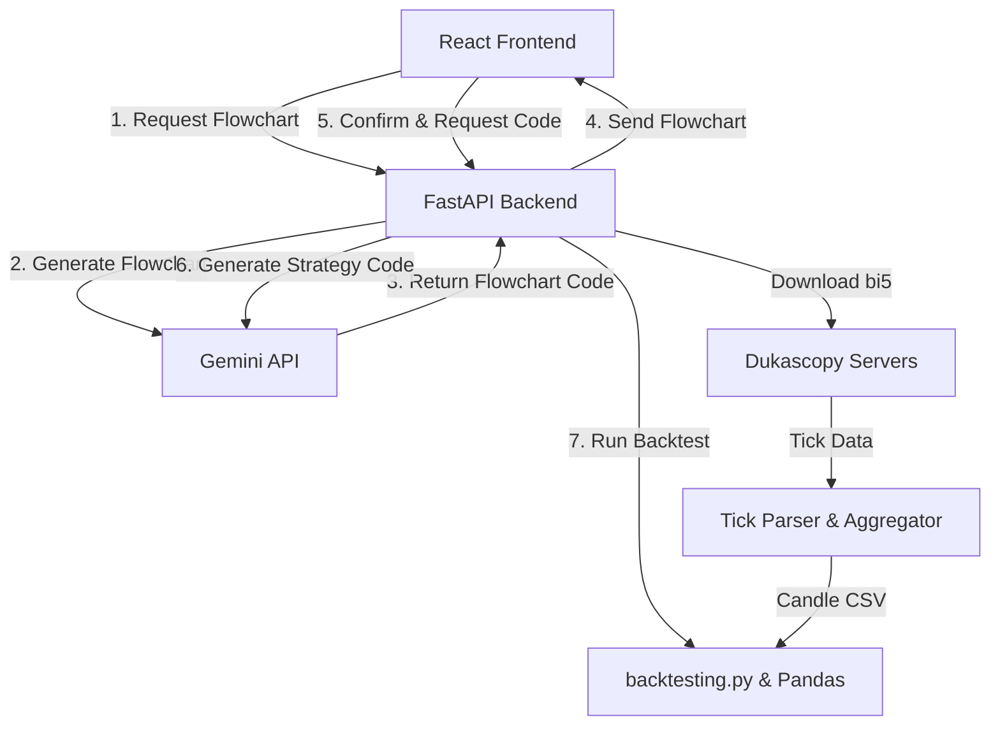

# 📈 Forex Strategy Backtester

A modern, web-based Forex strategy backtesting application powered by **FastAPI**, **React (Vite)**, and **Google Gemini LLM**. 

Describe trading strategies in plain English, visualize logic with interactive Mermaid flowcharts, compile to executable Python strategy scripts, and backtest against historical Dukascopy tick data.

---

## ✨ Features

- **Dukascopy Tick Downloader & Aggregator**: Custom Python downloader for Dukascopy LZMA-compressed `.bi5` tick data files, parsing 20-byte tick structs and aggregating them into 1m, 5m, 15m, 1h, and 1d OHLCV candle datasets.
- **AI Strategy Translator (Gemini LLM)**: Translates natural language trading rules into:
  - **Mermaid.js Flowcharts**: Visual decision trees mapping entry, exit, indicator filters, and risk management rules.
  - **`backtesting.py` Python Classes**: Syntactically valid Python code inheriting from `backtesting.Strategy` with built-in indicator calculations (SMA, EMA, RSI, ATR, Bollinger Bands).
- **Interactive Logic Verification**: Built-in verification gate in the UI requiring user approval of the flowchart before Python code compilation.
- **Backtest Execution Engine**: Dynamically loads and runs generated Python strategies on historical candle data with customizable starting equity and commission rates.
- **Performance Analytics Dashboard**:
  - Metric cards: Ending Balance, Net Return %, Win Rate %, Max Drawdown %, Sharpe Ratio, Profit Factor, Total Trades.
  - Interactive Recharts visualizer toggleable between Equity Curve and Drawdown.
  - Detailed trade log table with entry/exit timestamps, price levels, trade duration, return %, PnL, and pagination/filtering.

---

## 🏗️ System Architecture



---

## 🛠️ Tech Stack

### Backend
- **Framework**: Python 3.10+, FastAPI, Uvicorn
- **Backtesting Engine**: `backtesting.py`, Pandas, NumPy
- **LLM Integration**: Official `google-genai` SDK (`gemini-2.5-flash` / `gemini-2.5-pro`)
- **Data Parser**: Python built-in `lzma` & `struct` modules for Dukascopy `.bi5` binary files

### Frontend
- **Framework**: React 18, Vite, TypeScript
- **Diagrams & Charts**: Mermaid.js (dark mode), Recharts
- **Styling**: Modern Vanilla CSS with dark-mode tokens, custom glassmorphism panels, and neon accents
- **Icons**: Lucide React

---

## 📁 Repository Layout

```
forex_strategy_backtester/
│
├── backend/
│   ├── main.py                  # FastAPI server & endpoints
│   ├── downloader.py            # Dukascopy tick downloader & 1m candle aggregator
│   ├── llm_manager.py           # Gemini API client & system prompts
│   ├── backtest_runner.py       # Dynamic Python strategy executor
│   ├── test_verification.py     # Automated test suite
│   ├── requirements.txt         # Python dependencies
│   └── data/                    # Local CSV cache directory for candle data
│
├── frontend/
│   ├── index.html
│   ├── package.json
│   ├── vite.config.ts
│   ├── src/
│   │   ├── main.tsx
│   │   ├── App.tsx              # Main layout & pipeline state management
│   │   ├── index.css            # Dark theme design system & utilities
│   │   ├── api.ts               # API service calling backend endpoints
│   │   └── components/
│   │       ├── ControlPanel.tsx # Asset, timeframe, date range & download controls
│   │       ├── StrategyEditor.tsx # Text prompt input & code viewer
│   │       ├── FlowchartViewer.tsx # Mermaid flowchart renderer & verification
│   │       ├── Dashboard.tsx    # Metrics grid & equity/drawdown charts
│   │       └── TradeTable.tsx   # Detailed trade log table with filters
│   └── public/
│
├── .gitignore
├── implementation.md            # Technical specification document
└── README.md                    # Project documentation
```

---

## 🚀 Quick Start

### 1. Prerequisites
- **Python**: 3.10 or higher
- **Node.js**: v18 or higher
- **Gemini API Key**: Obtainable from [Google AI Studio](https://aistudio.google.com/)

### 2. Backend Setup
```bash
cd backend

# Create virtual environment
python -m venv .venv
# Activate on Windows:
.venv\Scripts\activate
# Activate on macOS/Linux:
# source .venv/bin/activate

# Install dependencies
pip install -r requirements.txt

# (Optional) Set environment variable for Gemini API Key
# Alternatively, enter your API key directly in the UI workspace panel
set GEMINI_API_KEY=your_api_key_here

# Start FastAPI server
python main.py
# Server runs at http://127.0.0.1:8000
```

### 3. Frontend Setup
```bash
cd frontend

# Install node packages
npm install

# Start Vite development server
npm run dev
# App opens at http://localhost:5173
```

---

## 🧪 Testing & Verification

Run the automated backend test suite to verify Dukascopy tick parsing and backtest execution:

```bash
cd backend
python test_verification.py
```

Expected output:
```text
Running Downloader/Parser Test...
Downloader and parser verification: SUCCESS
----------------------------------------
Running Backtest Runner Test...
Backtest results computed successfully!
Backtest runner verification: SUCCESS
----------------------------------------
ALL TESTS PASSED
```

---

## 📄 License

Distributed under the MIT License.
