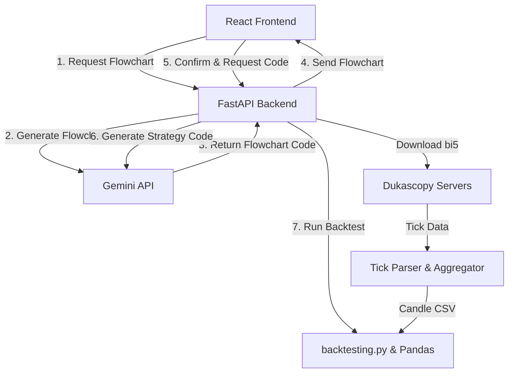

# Forex Strategy Backtester Implementation Plan

This document outlines the design and implementation details for a web-based Forex Strategy Backtester. The tool enables users to download historical Forex data from Dukascopy, describe a trading strategy in plain English, translate that strategy into Python code using Gemini LLM models, and run backtests across single or multiple timeframes.

---

## 1. System Architecture

The application will be divided into a **Python FastAPI backend** and a **React (Vite) frontend** using modern Vanilla CSS.



### Components:
1. **Frontend (React + Vite + TypeScript)**:
   - **Dashboard**: Interactive visual charts (equity curve, drawdown) and trading performance metrics.
   - **Control Panel**: Select trading pair, timeframe(s), date range, and Gemini model.
   - **Strategy Editor**: Plain English text area, Gemini API Key input, interactive strategy flow/flowchart previewer, and generated code viewer.
   - **Flowchart Viewer**: Renders the strategy logic visually (e.g., using Mermaid.js) for user verification before running the code.
   - **Trade Log Table**: Detailed historical trade log showing entry/exit times, prices, and profit/loss.
2. **Backend (FastAPI)**:
   - **Data Downloader**: Custom downloader for Dukascopy LZMA-compressed `.bi5` tick files, parsing and aggregating them into candles.
   - **LLM Translator**: Interfaces with the Gemini API to compile English descriptions into:
     - A structured flowchart (Mermaid.js code).
     - A Python class compatible with `backtesting.py`.
   - **Backtest Executor**: Dynamically executes generated Python classes against historical candle data and returns structured results.

---

## 2. Technical Stack

- **Frontend**: React 18, Vite, TypeScript, Chart.js (or Recharts) for charts, Mermaid.js for strategy flowchart rendering, Vanilla CSS with custom CSS variables for premium dark-mode aesthetics.
- **Backend**: Python 3.10+, FastAPI, Uvicorn, Pandas, `backtesting.py` (backtesting framework), `google-genai` (official SDK), `lzma` (built-in LZMA decompression).
- **Storage**: Local directory for downloaded and parsed CSV candle data (`data/` directory).

---

## 3. Implementation Steps

### Step 1: Backend Setup
- Initialize Python environment.
- Setup FastAPI server with endpoints:
  - `/api/pairs` - Retrieve supported currency pairs.
  - `/api/download` - Trigger and stream progress of historical tick data downloads.
  - `/api/generate-flowchart` - Convert English description into a visual Mermaid flowchart.
  - `/api/generate-strategy` - Convert English to Python using Gemini.
  - `/api/backtest` - Execute strategy script on data and return performance metrics + trade list + equity curve.

### Step 2: Dukascopy Tick Downloader & Aggregator
- **Download**: Dukascopy provides binary `.bi5` files containing 1 hour of tick data.
  - URL format: `https://datafeed.dukascopy.com/datafeed/{symbol}/{year}/{month:02d}/{day:02d}/{hour:02d}h_ticks.bi5`
- **Decompress & Parse**:
  - Read with `lzma.decompress()`.
  - Parse 20-byte structs: `(time_offset_ms, ask_price_int, bid_price_int, ask_volume_float, bid_volume_float)`.
- **Aggregate**: Resample parsed tick data to specified timeframes (e.g. 1m, 5m, 15m, 1h, 1d) using Pandas.

### Step 3: Gemini Strategy & Flowchart Generator
- **Flowchart Endpoint**:
  - Instruct Gemini via a precise system prompt to output *only* valid Mermaid.js flowcharts representing the entry, exit, risk management, and indicator logic of the described strategy.
- **Strategy Endpoint**:
  - Formulate a precise system prompt that guides Gemini to output *only* a valid, syntactically correct Python class extending `backtesting.Strategy` from `backtesting.py`.
  - Incorporate common technical indicators (using `ta-lib` equivalent helper functions or simple pandas calculations) inside the prompt context so Gemini knows how to define indicators.
  - Define a strict template structure for the LLM output.

### Step 4: Backtest Engine
- Build a runner that dynamically loads and executes the LLM-generated Python class.
- Pass parsed Pandas DataFrame (OHLCV) to `backtesting.Backtest`.
- Extract results:
  - Core metrics (Net Profit, Win Rate, Sharpe Ratio, Max Drawdown, Profit Factor).
  - Equity curve data series.
  - List of trades (Entry time, Exit time, Size, PnL, Duration).

### Step 5: Frontend Design & UI Development
- Build a dark-themed UI that looks clean and modern:
  - Neon accents (blue, cyan, purple).
  - Glassmorphic panels.
  - Responsive layout (grid dashboard).
- Key views:
  - **Strategy Workspace**: English input, Gemini API Key, flowchart review panel (Mermaid.js visual), and Python code viewer.
  - **Data Manager**: Simple form to fetch data for pairs (e.g. `EURUSD`, `GBPUSD`, `XAUUSD`) and dates.
  - **Results Visualizer**: Equity line chart, trade metrics grids, and downloadable Excel/CSV trade logs.

---

## 4. Proposed Directory Layout

```
forex_strategy_backtester/
│
├── backend/
│   ├── main.py                  # FastAPI app & routing
│   ├── downloader.py            # Dukascopy downloader & aggregator
│   ├── llm_manager.py           # Gemini API interface (Flowchart & Strategy generation)
│   ├── backtest_runner.py       # Dynamically runs backtests
│   ├── requirements.txt         # Backend Python packages
│   └── data/                    # Directory where CSV data will be cached
│
├── frontend/
│   ├── index.html
│   ├── package.json
│   ├── vite.config.ts
│   ├── src/
│   │   ├── main.tsx
│   │   ├── App.tsx
│   │   ├── index.css            # Core styles, modern dark-theme tokens
│   │   ├── components/
│   │   │   ├── ControlPanel.tsx
│   │   │   ├── StrategyEditor.tsx
│   │   │   ├── FlowchartViewer.tsx  # Mermaid flowchart renderer component
│   │   │   ├── Dashboard.tsx
│   │   │   └── TradeTable.tsx
│   │   └── api.ts               # API service calling FastAPI
│   │
│   └── public/                  # Static assets
│
└── implementation.md            # This specification document
```

---

## 5. Verification Plan

### Automated Testing:
- Unit tests for the Dukascopy downloader/parser.
- Test cases for strategy flowchart and code generation with mock prompts.
- Validation scripts to check `backtesting.py` executes generated strategies without crashing.

### Manual Verification:
- Input a simple MA crossover strategy in the textbox and verify that a correct visual flowchart is generated and displayed before code generation.
- Run backtests for `EUR/USD` on `15m` and `1h` timeframes.
- Verify generated code structure inside the UI viewer.
- Validate matching metrics between the chart and trade logs.
